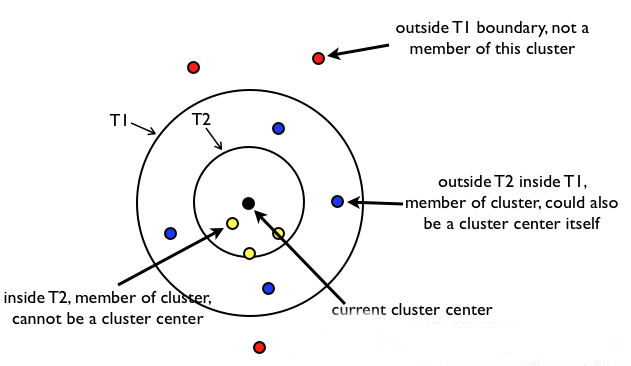

* content
{:toc}
#### 什么是聚类

##### 聚类概念

~~~
将物理或者抽象的集合分成由类似的对象组成的多个类的过程被称为聚类。
~~~

>聚类就是对大量未知标注的数据集，按照数据内部存在的数据特征将数据集划分为多个不同的类别，是类别内的数据比较相似，类别之间的数据相似度比较小；属于无监督学习。
>
>聚类算法的重点是计算样本项之间的相似度，有时候也陈伟样本间的距离。
>
>和分类算法的区别：
>
>​	分类算法是有监督学习，基于有标注的历史数据进行算法模型构建
>
>​	聚类算法是无监督学习，数据集中的数据是没有标注的

##### 相似度、距离公式1

>闵可夫斯基距离（Minkowski）
>$$
>dist(X,Y)=p\sqrt{\sum_{i=1}^n|x_i-y_i|^p}
>$$
>当p为1为曼哈顿距离（Manhattan）
>$$
>M_{dist}=\sum_{i=1}^n|x_i-y_i|\\
>$$
>当p为2为欧氏距离（Euclidean）
>$$
>E_{dist}=\sqrt{\sum_{i=1}^n(x_i-y_i)^2}
>$$
>
>当p为无穷大为切比雪夫距离（Chebyshev）
>$$
>C_{dist}=\max_i(|x_i-y_i|)
>$$
>
>##### 标准化欧式距离：
>
>$$
>X^*=\frac{X-\bar{X}}{s}\;\;\;s=\sqrt{\frac{\sum_{i=1}^n(s_i-\bar{s})^2}{n}}\;\;\;S\_E\_D=\sqrt{\sum_{i=1}^n\left(\frac{x_i-y_i}{s_i}\right)^2}
>$$
>

##### 相似度、距离公式2

>假设
>$$
>a=(x_{11},x_{12},..,x_{1n}),b=(x_{21},x_{22},...,x_{2n})
>$$
>求夹角余弦相似度（Cosine）：
>$$
>cos(\theta)=\frac{\sum_{k=1}^nx_{1k}x_{2k}}{\sqrt{\sum_{k=1}^nx_{1k}^2}*\sqrt{\sum_{k=1}^nx_{2k}^2}}=\frac{a^T*b}{|a||b|}
>$$
>KL距离（相对熵）：
>$$
>D（P||Q）=\sum_xP(x)log\left(\frac{P(x)}{Q(x)}\right)
>$$
>

##### 补充熵，信息熵，互信息，相对熵的概念

>熵：
>
>熵又称为自信息，可以描述一个随机变量的不确定性的数量。它表示信源X没发一个符号（无论什么符号）所提供的平均信息量。一个随机变量的熵越大，它的不确定性越大，其正确估计的可能性就越小。越不确定的随机变量越需要打的信息量用以确定其值。
>$$
>H(X)=-\sum_{x\in R}p(x)log_2(x)
>$$
>联合熵：
>
>如果X,Y是一对离散型随机变量X,Y~p(x,y),X,Y的联合熵H(X,Y)定义为：
>$$
>H(X,Y)=-\sum_{x\in X}\sum_{y\in Y}p(x,y)log(x,y)
>$$
>
>$$
>H(X|Y)=-\sum_{x\in X}p(x)H(Y|X=x)\\
>=\sum_{x\in X}p(x)\left[-\sum_{y\in Y}H(Y|X=x)\right]\\
>=-\sum_{x\in X}\sum_{y\in Y}p(x)p(y|x)\log p(y|x)\\
>=-\sum_{x\in X}\sum_{y\in Y}p(x,y)\log p(y|x)
>$$
>
>$$
>H(X,Y)=-\sum_{x\in X}\sum_{y\in Y}p(x,y)\log p(x,y)\\
>=-\sum_{x\in X}\sum_{y\in Y}p(x,y)[logp(x)+logp(y|x)]\\
>=-\sum_{x\in X}\sum_{y\in Y}p(x,y)p(x)-\sum_{x\in X}\sum_{y\in Y}p(x,y)\log p(y|x)\\
>=H(X)+H(Y|X)
>$$
>
>（12）为熵的连锁规则，推广到一般情况：
>$$
>H(X_1,X_2,...,X_n)=H(X_1)+H(X_2|X_1)+...+H(X_n|X_1,...,X_{n-1})
>$$
>互信息：
>$$
>H(X,Y)=H(X)+H(Y|X)=H(Y)+H(X|Y)\\
>$$
>​	因此：
>$$
>H(X)-H(X|Y)=H(Y)-H(Y|X)
>$$
>​	这个差叫做X和Y的互信息，记作$I(X;Y)$。或者定义为：如果$（X,Y）~p(x,y)$,则X,Y之间的互信息$（X;Y）=H(X)-H(X|Y)$。可以理解为知道了Y值以后X的不确定减少量，可以理解为Y的值透露了多少关于X的信息量。
>
> 
>
>如果定义中的H(X)和H(X|Y)展开，可得：
>$$
>I(X;Y)=H(X)-H(X|Y)\\
>=H(X)+H(Y)-H(X,Y)\\
>=\sum_{x}p(x)\log{\frac{1}{p(x)}}+\sum_{y}p(y)\log{\frac{1}{p(y)}}+\sum_{x,y}p(x,y)\log{p(x,y)}\\
>=\sum_{x,y}\log{\frac{1}{p(x)p(y)}}+\sum_{x,y}p(x,y)\log{p(x,y)}\\
>=\sum_{x,y}p(x,y)\log{\frac{p(x,y)}{p(x)p(y)}}
>$$
>由于H(X|X)=0,因此
>
>​	H(X)=H(X)-H(X|X)=1(X;X),这一方面说明了为什么熵称为自信息，另一方面又说明了两个完全相互依赖的变量的互信息并不是一个常量，而是取决于它们的熵。互信息体现了两个变量之间的依赖程度。
>
>推导出条件互信息和互信息的连锁规则：
>$$
>I(X;Y|Z)=I(X;Y|Z)=H(X|Z)-H(X|Y,Z)\\
>I(X_{1n};Y)=I(X_1,Y)+...+I(X_n,Y|X_1,...,X_{n-1})\\
>=\sum_{i=1}^nI(X_i,Y;X_1,...,X_{i-1})
>$$
>互信息在词汇聚类，汉语自动粉刺、词义消歧等问题的研究中具有中重要用途。
>
>相对熵：
>
>相对熵又被称为差异，或简称KL距离，是衡量相同事件空间里两个概率分布想丢差距的测度。两个概率p(x)和q(x)的相对熵定义为：
>$$
>D(p||q)=\sum_{x\in X}p(x)\log{\frac{p(x)}{q(x)}}\\
>$$
>该定义中约定$0\log{(0/q)}=0,p\log{(p/0)}=\infty$。表示成期望值为：
>$$
>D(p||q)=E_p\left(\log{\frac{p(X)}{q(X)}}\right)
>$$
>显然，当两个随机分布完全相同时，即p=q,其相对熵为0.当两个随机分布的差别增加时，其相对熵的期望值也增大。互信息实际上就是一个联合分布于独立性差距多大的测度：
>$$
>I(X;Y)=H(X)-H(X|Y)\\
>=-\sum_{x\in{X}}p(x,y)\log{p(x)}+\sum_{x\in X}\sum_{y\in Y}\log p(x|y)\\
>=\sum_{x\in X}\sum_{y\in Y}p(x,y)\log{\frac{p(x|y)}{p(x)}}\\
>=\sum_{x\in X}\sum_{y\in Y}P(x,y)\log{\frac{p(x,y)}{p(x)p(y)}}\\
>=D(p(x,y)||p(x)p(y))
>$$
>同样,我们也可以推导出条件相对熵和相对熵的连锁规则：
>$$
>D(p(y|x)||q(y|x))=\sum_xp(x)\sum_yp(y|x)\log{\frac{p(y|x)}{q(y|x)}}\\
>D(p(x,y)||q(x,y))=D(p(x)||q(x))+D(p(y|x)||q(y|x))
>$$
>

#### Jaccard相似度、Pearson相似度

##### 杰卡尔相似系数

$$
J(A,B)=\frac{|A\cap B|}{|A\cup B|}\;\;\;dist(A,B)=1-J(A,B)=\frac{|A\cup B|-|A\cap| B}{A\cup B}
$$

##### Peasron相关系数

$$
\rho_{XY}=\frac{Cov(X,Y)}{\sqrt{D(X)}\sqrt{D(Y)}}=\frac{E[(X-E(X))(Y-E(Y))]}{\sqrt{D(X)}\sqrt{D(Y)}}=\frac{\sqrt{\sum_{i=1}^n}(X_i-\mu_x)^2}{\sqrt{\sum_{i=1}^n(Y_i-\mu_Y)^2}}
dist(X,Y)=1-\rho_{XY}
$$

#### K-means聚类

##### 聚类的思想

给定一个有M个对象的数据集，构建一个具有k个簇的模型，其中k<=M.满足以下条件：

​	每个簇至少包含一个对象

​	每个对象属于且仅属于一个簇

​	将满足上述条件的k个簇称为一个合理的聚类划分

基本思想：对于给定的类别数目K,首先给定初始划分，通过迭代改变样本和簇的隶属关系，是的每次处理后得到的划分方式比上一次的好（总的数据集之间的距离和变小了）

##### K-Means算法

K-Means算法，也称为K-Means平均或者K-均值，是一种使用广泛的最基础的聚类算法，一般作为掌握聚类的第一个算法

假设输入样本为$T=X_1,X_2,...,X_m$;则算法步骤为（使用欧几里得距离公式）：

​	选择初始化的k个类别中心$a_1,a_2,...,a_k$;

​	对于每个样本$X_i$,将其标记位置类别中心$a_j$最近的类别j

​	更新每个类别的中心点$a_j$为隶属该类别的所有样本的均值

​	重复上面两步操作，直到达到某个终止条件

终止条件：

​	迭代次数、最小平方差MSE、簇中心点变化率
$$
label_i=\underset{1<=j<=k}{argmin}\left\{\sqrt{\sum_{i=1}^n(x_i-a_j)^2}\right\}
$$

$$
a_j=\frac{1}{N_(c_j)\sum_{i\in c_j}x_i}
$$

##### K-Means算法过程

记K个簇中心分别为$a_1,a_2,...,a_k$;每个簇的样本数量为$N_1,N_2,...,N_k$;

使用平方差作为目标函数（使用欧几里得距离），公式为：
$$
J(a_1,a_2,...,a_k)=\frac{1}{2}\sum_{j=1}^K\sum_{i=1}^{N_j}(\vec{x_i}-\vec{a_j})^2
$$
要获取最优解，也就是目标函数需要尽可能的小，对函数求偏导数，可以得到簇中心点a更新的公式为：
$$
\frac{\part J}{\part a_j}=\sum_{i=1}^{N_j}(x_i-a_j)\overset{令}\rightarrow0\Rightarrow a_j=\frac{1}{N_j}\sum_{i=1}^{N_j}x_i
$$

##### K-Means算法注意的地方

K-means算法在迭代过程中使用所有点的均值作为新的质点（中心点），如果簇中存在异常点，将导致均值偏差比较严重

​	比如一个簇中有2、4、6、8、100五个数据，那么新的质点为24，显然这个质点利绝大多数点都比较元；在当前情况下，使用中位数6可能比使用均值的想法更好，使用中位数的聚类方式叫做K-Means聚类（K中值）聚类
K-Means算法是初始值敏感，选择不同的初始值可能导致不同的簇划分规则

​	为了避免这种敏感性导致的最终结果异常性，可以采用初始化多套初始节点构造不同的分类规则，然后选择最优的构造规则

##### K-Means算法的优缺点

缺点：

​	K值是用户给定的，在进行数据处理前，K值是未知的，不同的K值得到的结果也是不一样的；

​	对初始簇中心点是敏感的

​	不适合发现非凸形状的簇或者大小差别较大的簇

​	特殊值（离散值）对模型的影响比较大

优点：

​	理解容易，聚类效果不错

​	处理大数据集的时候，该算法可以保证较好的伸缩性和高效性（修改算法执行过程）

​	当簇近似高斯分布的时候，效果非常不错

##### 二分K-means算法

解决K-Means算法对初始化促中心比较敏感的问题，二分K-Means算法是一种弱化初始质心的一种算法，

具体思路如下：

​	将所有样本数据作为一个簇放单一个队列中

​	从队列中选择一个簇进行K-Means算法划分，划分为两个子簇，并将簇添加到队列中

​	循环迭代第二步操作，知道终止条件达到（聚类数量，最小平方误差，迭代次数等）

​	队列中的簇就是最终的分类簇集合

从队列选择划分聚类的规则一般有两种方式：

​	对所有簇样本的距离SSE(SSE也可以认为是距离函数的一种变种)，选择SSE最大的聚簇进行划分操作（优选这种策略）

​	选择样本数量最多的簇进行划分操作
$$
SSE=\sum_{i=1}^nw_i(\vec{x_i}-\vec{a_{x_i}})^2
$$

##### K-Means++算法

解决K-Means算法对初始簇心比较敏感的问题，K-Means++算法和K-Means算法的区别在于K个中心点的选择方面，K-Means算法使用随机给定的方式，K-Means++算法采用下列步骤给定K个初始质心：

​	从数据集中任选一个节点作为第一个聚类中心

​	对数据集中每个点x，计算x到所有已有聚类中心点的距离和D(X),基于D(X)采用线性概率选择出下一个聚类中心点（距离较远的一个点成为新增的一个聚类中心点）

​	重复步骤2直到找到k个聚类中心

缺点：由于聚类中心点选择过程中的内在有序性，在扩展存在着性能方面的问题（第k个聚类中心点的选择依赖前k-1个聚类中心点的值）

##### K-Means||算法

解决K-Means算法++算法缺点而产生的一种算法：主要思路是改变每次遍历时候的取样规则，并非按照K-Means++算法每次遍历值获取一个样本，而是每次随机获取k个样本，重负该取样操作logn次，然后再将这些抽样出来的样本聚类出K个点，最后使用这K个点作为K-Means算法的初始聚簇中心点。实践证明，一般五次重复采用就可以保证一个比较好的聚簇中心点。

#### Canopy算法

Canopy算法属于一种‘粗’聚类算法，执行速度比较快，但精度比较低，算法执行步骤如下：

>给定样本列表$L={X_1,X_2,...X_M}$和超参数$r_1和r_2(r_1>r_2)$。
>
>从列表L中获取一个节点P,计算P到所有聚簇中心的距离，并找到最小的距离$D(P,a_j)$。
>
>如果D小于$r_1$,表示该节点属于该聚簇，添加到聚簇列表中。
>
>如果D小于$r_2$,表示该节点不仅仅属于该聚簇，该表示和当前聚簇中心点非常近，所以讲该聚簇的中心点设置为该聚簇中所有样本的中心点，并将P从该列表L中删除。
>
>如果距离大于$r_1$,那么节点P形成一个新的聚簇，并将P从列表L重删除。
>
>直到列表中的元素数据不在有变化或者元素数量为0的时候，结束循环列表操作。

##### Canopy算法应用场景

由于K-Means算法存在初始聚簇中心点敏感的问题，常使用Canopy+K-Means算法混合形式进行模型构建。

​	先使用Canopy算法进行“粗”聚类得到K个聚类中心点

​	K-Means算法使用Canopy算法得到的K个聚类中心点作为初始中心点，进行“细”聚类

优点：

​	执行速度快（先进行了一次聚簇中心点选择的预处理）

​	不需要给定K值，应用场景很多

​	能够缓解K-Means算法对于初始聚类中心点敏感的问题

#### Mini Batch K-Means算法

Mini Batch K-Means算法是K-Means算法的一种优化变种，采用小规模的数据子集（每次训练使用的数据集是在训练算法的时候随机抽取的数据子集）减少计算时间，同时试图优化目标函数；Mini Batch K-Means算法可以减少K-Means算法收敛的时间，而且产生的结果效果只是略差于标准K-Means算法

算法步骤如下：

​	首先抽取部分数据集，使用K-Means算法构建出K个聚簇点的模型

​	据需抽取训练数据集中的部分数据集样本数据，并将其添加到模型中，分配给距离最近的聚簇中心点

​	更新聚簇的中心点值

​	循环迭代第二步和第三步操作，直到中心点稳定或者达到迭代次数，停止计算操作

#### 聚类算法效果评估（准确率、召回率等）

>有监督的分类算法的评价指标通常是准确率，精确率，召回率，等等；由于聚类算法是无监督的学习算法，评价指标则没有那么简单。聚类算法得到的类别实际上不能说明任何问题，除非这些类别的分布和样本的真实类别分布相似，或者聚类的结果满足某种假设，即同一种类别中样本间的相似性高于不同类别间样本的相似性。

##### 混线矩阵

######  1、均一性又叫完整性

一个簇中值包含一个类别样本，满足均一性，也可以认为正确率（每个簇中正确分类占该簇总样本的比），公式如下：
$$
p=\left\{\begin{matrix}
1 ,&if\;\;H(C)=0 \\ 
1-\frac{H(C|K)}{H(K)}
\end{matrix}\right.
$$

###### 2、完整性

同类别样本被归类到相同簇中，则满足完整性；
$$
r = \left\{\begin{matrix}
1;&if\;\;\;H(K)=0\\
1-\frac{H(K|C)}{H(K)}
\end{matrix}\right.
$$
###### 3、V-measure

均一性和完整性的加权平均：
$$
\upsilon_{\beta}=\frac{2pr}{p+r}
$$

###### 4.兰德系数（Rand index）

调整兰德系数（ARI,Adjust Rnd Index），ARI取值范围[-1,1]，值越大，表示聚类结果和真实情况越吻合。从广义的角度来说，ARI是衡量两个数据分布的吻合程度的。

$$
ARI=\frac{Index-EIndex}{MaxIndex-EIndex}=\\
\frac{\sum_{i,j}C_{n_{i,j}}^2-[(\sum_iC_{a_i}^2)(\sum_jC_{b_j}^2)]/C_n^2}{\frac{1}{2}[(\sum_iC_{a_i})^2+(\sum_jC_{b_j})^2]-[(\sum_iC_{a_i})^2(\sum_jC_{b_j})^2]}
$$

###### 5、调整互信息（AMI）

###### 6、轮廓系数（Silhouette）

#### 层次聚类算法

#### 密度聚类算法

#### 谱聚类算法

