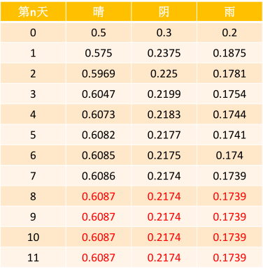
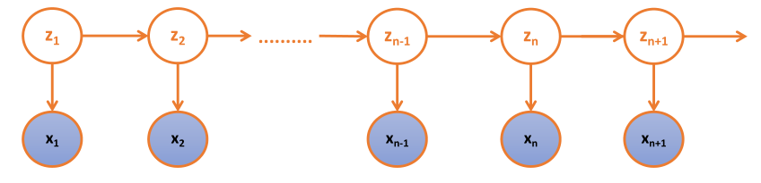

* content
{:toc}
### 1.马尔科夫性质

设$\{X(T),t\in T\}​$是一个随机的过程，E为其状态空间，若对于任意的$t_1<t_2<...<t_n<t​$,任意的$x_1,x_2,...,x_n,x\in E​$，随机变量$X(t)​$在已知变量$X(t_1)=x_1,...,X(t_n)=x_n​$之下的条件分布函数只与$X(t_n)=x_n​$有关，耳语$X_{(t_1)}=x_1,...,X(t_{n-1})=X_{n-1}​$无关，即条件分布函数满足下列等式，此性质称为马尔科夫性；如果随机过程满足马尔科夫性，则该过程称为马尔科夫过程。
$$
p(X(t)\leq x|X(t_1)=x_1,...,X(t_n)=x_n)=p(X(t)\leq x|X(X(t_n)=x_n))\\
p(X_{n+1}=x|X_1=x_1,...X_n=x_n)=p(X_{n+1}=x|X_n=x_n)
$$

### 2.马尔科夫链

马尔科夫链是指具有马尔科夫性质的随机过程。在这个过程中，在给定当前信息的情况下，过去的信息状态对于预测将来状态是无关的。

在马尔科夫链的每一步，系统根据概率分布，可以从一个状态变成另一个状态，也可以保持当前状态不变。状态的改变叫做转移，状态改变的相关概率叫做转移概率。

马尔科夫链中的三元素是：状态S，转移概率矩阵P，初始概率分布$\pi$

#### 2.1马尔科夫链案例：

设天气状态为晴天，阴天，雨天三种小黄太，假定某天的天气状态只和上一天额的天气状态有关，状态使用1（晴）、2（阴）、3（雨）表示，转移概率矩阵P如下：

第$n+1$天天气状态为j的概率为：
$$
\pi(X_{n+1}=j)=\sum_{i=1}^K(X_n=i)*P(X_{n+1}=j|X_n=i)\\
\Rightarrow\pi^{n+1}=\pi^n*P
$$
因此，矩阵P即为条件概率转移矩阵。

​	矩阵P的第i行元素表示，在上一个状态为i的时候的分布概率，即每行元素的和必须为1

​	初始概率$\pi[0.5,0.3,0.2]​$
$$
P=\begin {bmatrix}
0.75&0.125&0.125\\
0.5&0.25&0.25\\
0.25&0.5&0.25
\end {bmatrix}
$$

### 3.HMM

#### 3.1HMM说明

隐马尔可夫模型是一种统计模型，在语音识别、行为识别、NLP、故障诊断等领域具有高效的性能。

HMM是关于时序的概率模型，描述一个甘油位置参数的马尔科夫链锁生成的不可观测的状态的随机序列，再由各个状态生成观测随机序列的过程。HMM是一个双重随机过程---具有一定状态的隐马尔可夫链和随机的观测序列。

HMM堆积生成的状态随机序列被称为状态序列；每个状态生成一个观测，由此产生的观测随机序列，被称为观测序列。

$z_1,z_2,...z_n$是不可观测的状态，$x_1,x_2,...,x_n$是可观测到的序列；不可观测的状态决定棵观测序列的值（z的值决定x的取值）。

HMM由隐含正太S、棵观测状态O、初始状态概率矩阵/向量$\pi$、隐含状态转移概率矩阵A、可观测值转移矩阵B（又称为混淆矩阵，Confusion Matrix）。

$\pi$和A决定了状态序列，B决定了观测序列，因此HMM可以使用三元符号表示，称为HMM的三元素：
$$
\lambda=(A,B,\pi)
$$

#### 3.2HMM参数说明

S是所有可能的状态集合：$S=\{s_1,s_2,...,s_n\}$

O是所有可能的观测集合：$O=\{o_1,o_2,...,o_m\}$

I是长度为T的状态序列，Q是对应的观测序列
$$
I=\{i_1,i_2,...,i_T\}\quad Q=\{q_1,1_2,...,q_T\}
$$
A是隐含庄毅概率矩阵：
$$
A=[a_{ij}]_{n*n}=\begin{bmatrix}
a_{11}&a_{12}&...&a_{1n}\\
a_{21}&a_{22}&...&a_{2n}\\
...&a...&...&...\\
a_{n1}&a_{n2}&...&a_{nn}\\
\end{bmatrix}
$$
其中$a_{ij}=p(i_{t+1}=s_j|i_t=s_i)$

​	$a_{ij}$是在时刻t处于状态$s_i$的条件下时刻$t+1$转移到状态$s_j$的概率。

B是可观测值转移概率矩阵：
$$
B=[b_{ij}]_{n*m}=\begin{bmatrix}
b_{11}&b_{12}&...&b_{1m}\\
b_{21}&b_{22}&...&b_{2m}\\
...&...&...&...\\
b_{n1}&b_{n2}&...&b_{nm}\\
\end{bmatrix}
$$
其中$b_{ij}=p(q_t=o_j|i_t=s_i)$

​	$b_{ij}$是在时刻t处于状态$s_i$的条件下生成观测值$o_j$的概率。

$\pi$是初始状态概率向量：
$$
\pi=(\pi_i)_{1*n}=(\pi_1,\pi_2,...,\pi_n)
$$
其中$\pi_i=p(i_1=s_i)$

​	$\pi_i$是在时刻$t=1$处于状态$s_i$的概率。

#### 3.3HMM的两个基本性质

$$
p(i_t|i_{t-1},q_{t-1},i_{t-2},q_{t-2},...,i_1,q_1)=p(i_t|i_{t-1})\\
p(q_t|i_t,i_{t-1},q_{t-1},i_{t-2},q_{t-2},...,i_1,q_1)=p(q_t|i_t)
$$

#### 3.4HMM案例

假设有三个盒子，编号为0,1,2；每个盒子都装有黑白两种颜色的小球，球的比例如下：

| 编号 | 白球 | 黑球 |
| ---- | ---- | ---- |
| 0    | 4    | 6    |
| 1    | 8    | 2    |
| 2    | 5    | 5    |

按照下列规则的方式进行又放回的抽取小球，得到球的颜色的观测序列：

按照$\pi$的概率选择第一个盒子，从盒子中随机去除一个小球，记录颜色后，放回盒子中；

按照某种条件概率选择新的盒子，重复该操作；

最终得到观测序列：“白黑白白黑”